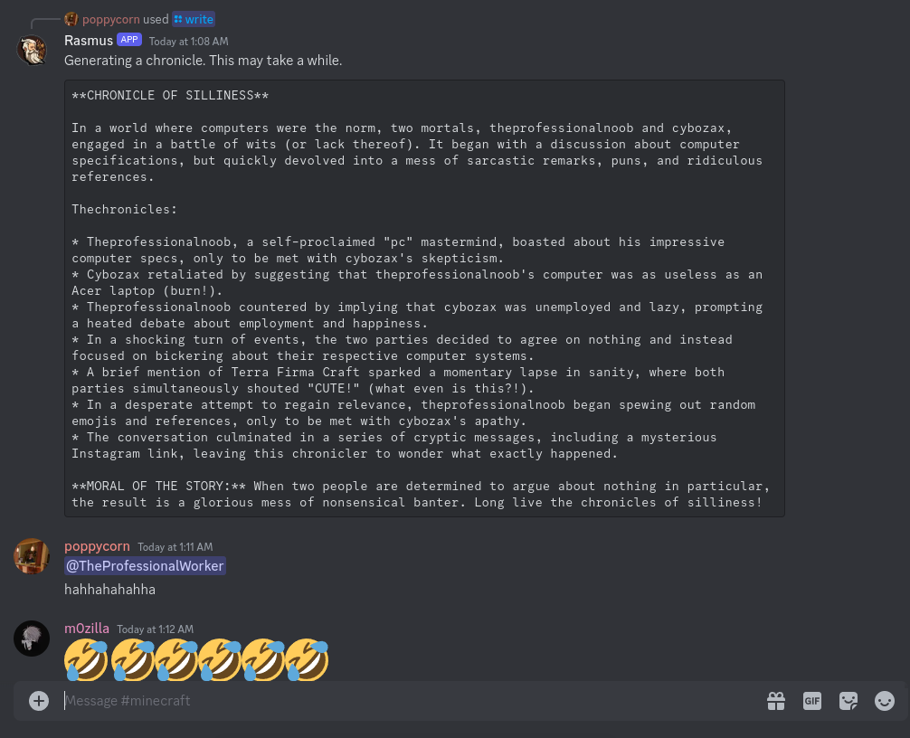

<h1 align="center">Rasmus Ravioli, the chronicler</h1>

Good ol' Rasmus is a celebrated chronicler that will read your discord channel's message history and write a short chronicle based on it. 
Powered by Llama3-8b, Meta AI's open LLM.

<a href="https://discord.com/oauth2/authorize?client_id=1238193785582649455&permissions=68608&scope=bot">Add to your server</a>

### Dependencies for running locally

- node
- ngrok
- ollama

### Future

- ~~Maybe use the HuggingFace inference API~~ (The free endpoints are not suitable for this usecase).
- Finetune smaller models for this usecase.
